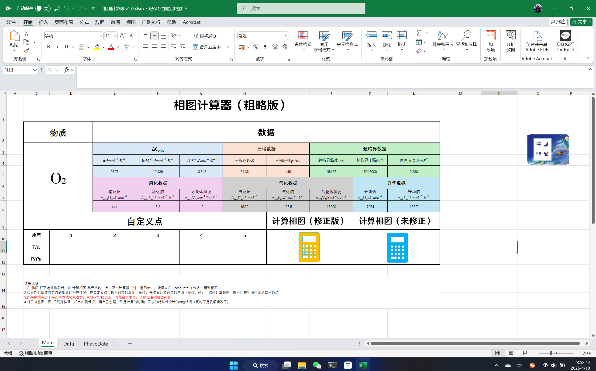

# 相图计算器 v1.0版本发布

概要：

使用说明：

1. 在“物质”栏下选好物质后，在“计算相图”单元格内，点击那个计算器（对，是图标），就可以在“PhaseData”工作表中看到相图
2. 如果你想知道特定点的物质的物态情况，在自定义点中输入对应的温度（单位：开尔文）和对应的压强（单位：帕），点击计算相图，就可以在相图中看到自己的点
3. 如果你的点过于接近临界状况或者靠近离“液-气”线过近，可能会有偏差，请根据准确相图判断
4. 对于有些图中固-气线延伸至三相点右侧情况，请自己忽略，只是计算的时候由于水的特殊性设计的bug代码（真的不是我懒得改了）